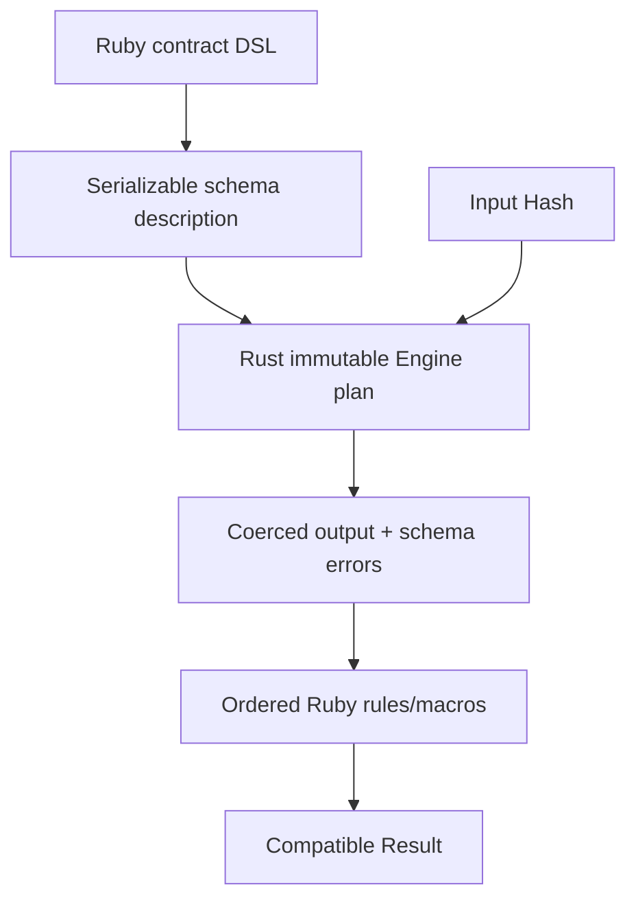

# Architecture

## Runtime shape

The implementation separates definition-time Ruby flexibility from
call-time native processing.



The plan is compiled once per contract schema. Contract instances reuse the
same typed native object.

## Definition phase

### Ruby DSL

`Schema::DSL` and `Schema::FieldBuilder` capture:

- schema mode;
- key name and requiredness;
- type, nullable, and filled flags;
- array member plan;
- nested children;
- predicate name and arguments.

Supported native predicates are serialized into the plan. Predicates whose
semantics are specifically Ruby-owned (Regexp, inclusion, `eql?`) remain on
the Ruby field definitions and run after native structural processing.

### Plan boundary

Ruby serializes the schema description to JSON. This happens only while the
schema is defined. The native constructor:

1. parses JSON using serde;
2. checks the engine-plan version;
3. builds Rust structs and enums;
4. stores only Rust-owned values.

No unmarked Ruby object is stored in the Rust heap. This avoids a common and
serious Magnus GC error: a raw Ruby `VALUE` hidden in a Rust `Vec` or
`HashMap` could otherwise be collected.

The native object exposes `field_count` and `plan_bytes` for diagnostics.

### Rust extension layout

The native extension keeps the Magnus binding in `lib.rs` and separates plan parsing, traversal, coercion, predicate evaluation, errors, and GVL-bound Ruby calls into focused modules.

```text
ext/dry_validation_rust/src/
├── lib.rs          # Magnus binding, module declarations, and re-exports
├── plan.rs         # Plan deserialization, PredicateArg, and version check
├── engine.rs       # Input traversal, output construction, errors, depth guard
├── coercion.rs     # Mode-specific scalar coercion
├── predicates.rs   # Native predicate evaluation
├── error.rs        # Native errors, path parts, and error helpers
└── ruby_bridge.rs  # GVL-bound calls into CRuby
```

## Call phase

### Native schema processor

`Engine#call` receives a Ruby Hash and processes each declared field:

1. look up a symbol key and, in Params/JSON mode, its string form;
2. report required-key failures;
3. handle nullable/filled state;
4. apply mode-specific coercion;
5. validate the expected type;
6. recurse into nested hashes or array members;
7. apply supported native predicates;
8. write a symbol-keyed filtered output Hash;
9. return error tuples of path, code, and text.

Unknown input keys are omitted, matching the default schema behavior.

The processor preserves an invalid raw value in output while reporting its
type error. That is important for result inspection and follows the common
dry-schema behavior.

### Ruby predicate completion

The Ruby `Schema` walks the already processed output for predicates that
should preserve Ruby semantics:

- Regexp `format?`;
- `included_in?` and `excluded_from?`;
- `eql?` and `not_eql?`.

They are skipped when the same path already has a structural/type error.

### Contract rules

`Contract#call` creates a `Result` and visits class rules in declaration order.
A rule is skipped when a declared dependency path intersects a schema error.

`Evaluator` uses `instance_exec`, so a rule retains the familiar environment:

- `value` and `values`;
- key and base failure accumulators;
- context and index keyword arguments;
- schema/rule error queries;
- delegation to private or public contract methods;
- injected option readers.

`rule.each` expands its root array to indexed evaluator paths after member
schema processing.

### Results and messages

`Result` combines immutable schema messages with rule messages. It provides:

- success/failure predicates;
- processed values and Hash conversion;
- path queries;
- context;
- message-set conversion/filtering;
- hash and tuple pattern matching.

`MessageSet#to_h` builds nested hashes for paths, including integer array
indexes. Explicit rule metadata is preserved as a Hash payload.

## Coercion modes

| Mode     | Key behavior                            | Value behavior                      |
| -------- | --------------------------------------- | ----------------------------------- |
| `schema` | Symbol keys only                        | No coercion                         |
| `json`   | String or symbol input to symbol output | No scalar coercion                  |
| `params` | String or symbol input to symbol output | Supported HTTP-like scalar coercion |

Params coercions currently include integer, finite float, boolean, symbol,
Date, DateTime, Time, and BigDecimal. Empty strings become nil for `maybe`
fields.

## GVL and concurrency

The plan contains only immutable Rust data and can be safely reused by Ruby
threads. Each call allocates its own output and error state.

The processor still calls CRuby APIs to read Hashes, create output objects,
create Date/Time/BigDecimal values, and invoke a small set of Ruby operators.
Therefore it must hold the GVL.

The design must never call CRuby APIs inside a `without_gvl` region.

### Possible future batch engine

A GVL-releasing batch path would require:

1. under GVL, convert supported Ruby input into Rust-owned enums;
2. release GVL;
3. validate/coerce the Rust values in parallel or serial native code;
4. reacquire GVL;
5. materialize Ruby results.

This is attractive for large arrays or validation jobs, but the copy cost can
outweigh the gain for web-sized Hashes. It should be a distinct API with
separate benchmarks.

## Error safety

Native conversion returns `Result` values through Magnus. Ruby exceptions
raised by CRuby calls become `magnus::Error` and unwind safely into Ruby.
Schema-plan parse/version errors become `ArgumentError` and are wrapped by the
Ruby layer as `NativeExtensionError` with context.

Rust panics must not be used for user input. The current plan parser and
processor return errors for malformed definitions and conversion failures.

## Packaging

The gem uses the standard native extension contract:

- `ext/dry_validation_rust/extconf.rb`;
- `rb_sys/mkmf` to generate a Makefile;
- Cargo `cdylib` output;
- an `Init_native` entry point;
- installation under `dry_validation_rust/native`.

`Cargo.lock` is included for reproducible source-gem builds. Release builds
enable thin LTO, one codegen unit, and debug-info stripping.

The source checkout loader also looks for
`ext/dry_validation_rust/native.so`, allowing tests without installing the gem.

## Portability

Current target:

- CRuby 3.3+;
- Linux and macOS source builds expected;
- x86-64 Linux verified in this work;
- Windows unverified;
- JRuby and TruffleRuby unsupported by this native backend.

Precompiled platform gems should be considered only after CI covers Ruby
3.3/3.4/current, glibc and musl Linux, macOS arm64/x86-64, and Windows if it is
in scope.

## Production hardening roadmap

### Phase 1 — parity harness

- Derive behavior cases from public documentation with independent test code.
- Run the same fixture corpus in separate processes against upstream and Rust.
- Compare processed values, ordered errors, paths, metadata, and exceptions.
- Add property tests for nested structures and coercion edge cases.

### Phase 2 — schema surface

- Implement strict unexpected-key validation.
- Expand type/coercion parity, including constructors and array/hash edge cases.
- Support predicate composition ASTs and custom predicate callbacks.
- Add standalone schema composition and processor hooks.

### Phase 3 — messages/configuration

- Implement YAML namespaces, locales, tokens, full-message key translation,
  and configurable load paths.
- Add an I18n adapter.
- Implement hints and info message extensions.

### Phase 4 — contract ecosystem

- Complete macro parity and predicate-as-macro messages.
- Add monad extension compatibility.
- Test dry-auto_inject and Rails autoload/reload behavior.
- Formalize Ractor behavior or explicitly reject it.

### Phase 5 — safety and performance

- Fuzz plan deserialization and recursive input processing.
- Add recursion/depth and allocation guards for hostile payloads.
- Use sanitizers and `cargo audit` in CI.
- Benchmark upstream and native across representative payload matrices.
- Track throughput, latency percentiles, Ruby allocations, native allocations,
  and peak RSS.

### Phase 6 — release engineering

- CI platform/Ruby matrix.
- Reproducible source gem and optional platform gems.
- SemVer compatibility policy and upstream-version target.
- Security policy, changelog, and maintainer contact.
- Public naming/relationship discussion with Hanakai maintainers before
  publication.
